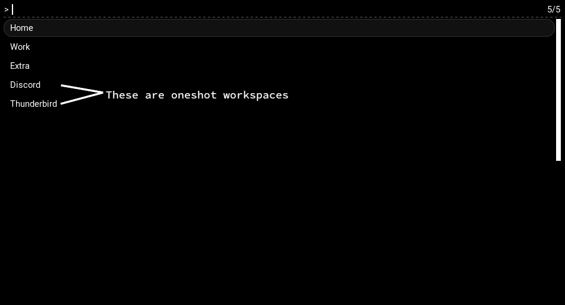

# coffeesuite


> [!info] Built for Linux  
> This program is intended for use on a linux system with hyprland being used.

Configuration file locations:
- `/etc/coffeesuite/config.json` System settings
- `~/config/coffeesuite/config.json` User Prefered Settings

## Hyprland Oneshots

coffeesuite will make certain programs auto create their own "oneshot" workspaces.
```jsonc
// config.json
{
	"oneshots": {
		"Discord": {
			"class": "discord"
		},
		"Thunderbird": {
			"class": "*.Thunderbird"
		}
	}
}
```


## Battery Indicator

Will add a notification about the battery when its `low`, `critical` or `full`.
```jsonc
// config.json
{
	"battery": {
		"low": 10, // 10 by default
		"critical": 5, // 5 by default
	}
}
```